# Simultaneous End-to-End Vehicle and License Plate Detection with Multi-Branch Attention Neural Network ***Supplementary Materials***

## III. METHODOLOGY
### A. Base Network
The details of the backbone network are shown in Table I without the ReLU activation function, where layers with **bold** font denote the transformed VGG-16 and the remainders represent the extra layers. As for parameters, "k" means kernel size, "s" stride size, and "d" dilation[1] parameters. In addition, "ceil" means rounding up the size if not divisible, so the size of conv3_3 maybe not exactly 2 times of conv4_1. In addition, layers marked with "\*" are candidates for detection head layers.

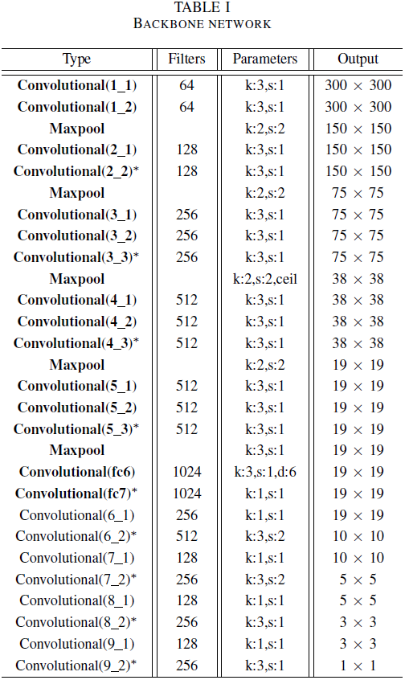

### B. Detection Branch
The scale of features in different layers may be quite different, making it difficult to combine them for detection directly, as illustrated in Figure 1. After normalization, features from different layers are of the same order of magnitude.

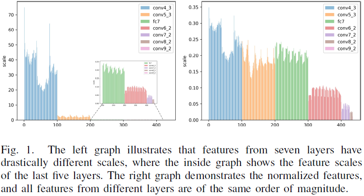

### C. Anchor Design Strategy
IoU(Intersection over Union) is calculated as Equation (1).

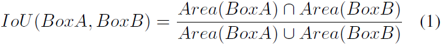

The average IoU and spatial IoU are demonstrated in Figure 2, where the only difference is whether to consider the ***spatial position*** of the anchors.

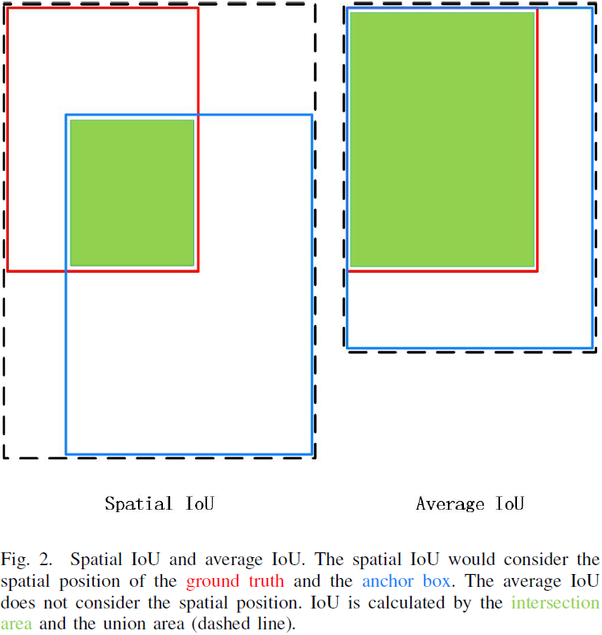

Moreover, the anchor clustering is carried out for the vehicle detection branch and the license plate detection branch separately. Figure 3 illustrates the anchor distribution mapped back to the original image. The lighter color corresponds to the anchors of the shallower head layers and the darker color corresponds to the anchors of the deeper head layers, where the anchors of shallow layers are small, dense and the anchors of deep layers are large, sparse. For simplicity, only three levels of anchors in the vehicle detection branch are presented, where there should be six in all. As can be seen, the cluster centroids of the vehicle are tall, thin boxes and the cluster centroids of the license plate are short, wide boxes.

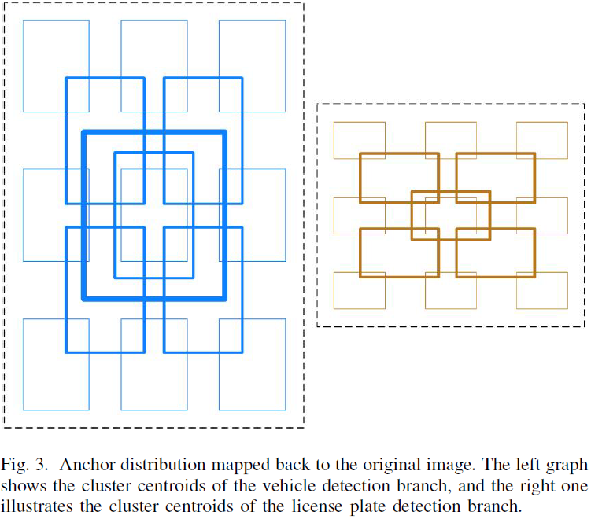

Furthermore, like SSD[2], the anchor priors are placed on multiple feature maps. Let F be the number of feature maps, Si be the size of the i-th feature map, Ai be the number of anchors placed on the i-th feature map, Nanchor be the total number of anchors. The number of anchors is calculated as Equation (2). For SSD300, the size of six head layers are S={38, 19, 10, 5, 3, 1}, and the anchor number of six head layers are A={4, 6, 6, 6, 4, 4}. From Equation (2), the number of anchors is calculated by 8732 = (38x38x4) + (19x19x6) + (10x10x6) + (5x5x6) + (3x3x4) + (1x1x4), et cetera.

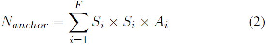

### D. Attention and Feature Fusion
Figure 4 demonstrates two feature fusion building blocks from ION[3] and FSSD[4]. The only differece between ION and FPN[9] is the fusion mode, where FPN is element-wise addition and ION is concatenation by channel. FSSD extends a series of pyramid features after the FPN fusion for detection.

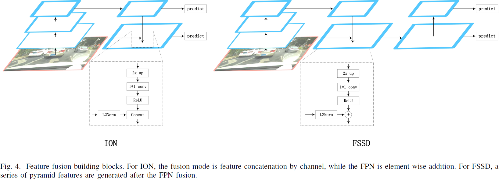

## IV. EXPERIMENTS
### A. Datasets

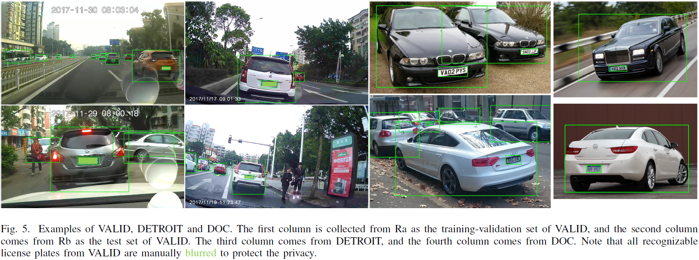

***VALID*** For simplicity, we name our dataset VALID (Vehicle And LIcense plate Dataset). We employ one auto-mobile data recorder (Ra) to collect videos on the road of a Chinese city(Zhuhai, China) with the resolution of 720p(720 x 1280, 25FPS). The accumulative total time of videos is about four hours and they are all collected in the daytime. In order to enable data diversity, our data acquisition process was carried out in four days, one hour each day, in different places, such as the city center, suburb, expressway, residential area, etc. Furthermore, we also export ten five-minute videos from another auto-mobile data recorder (Rb), where all videos have the same resolution with videos from Ra. After key-frame extraction every 30 frames, five volunteers worked one day to filter out duplicated or almost invariable images as well as images without vehicles. Finally, 887 images are carefully annotated in one week by five volunteers, where 78 images from Rb are used as the test set and the rest 809 images from Ra are randomly divided into the training set and the validation set by 7:3. Some examples of VALID are illustrated in Figure 5. Each license plate must correspond to a vehicle, and a vehicle not always contains a license plate.

***DETROIT*** Open Image Dataset (OID) V4[5] is a dataset of about 9 million images that have been annotated with image-level labels, object bounding boxes, and visual relationships. The dataset spans 600 object classes and the set of all classes are formed as a hierarchy (for instance, "Car" includes "Vehicle registration plate"). Considering that the annotations of the training set of OID are fairly coarse and have unbearable mistakes, we utilize the test set of OID as the training-validation set and the validation set of OID as the test set because of their relatively fine annotations. The training set and the validation set are divided randomly by 7:3. To get the DETROIT (DatasET fRom Open Image daTaset), we first picked out all annotations containing "Vehicle registration plate" and their corresponding images from OID. Secondly, we only preserved the annotations of "Car" and "Vehicle registration plate", as illustrated in Figure 5. The images of DETROIT are obtained from the Internet, and the size and aspect ratio vary greatly, where the size (height x width) ranges from 433 x 1000 to 4000 x 6016 and the aspect ratio (width/height) scopes from 1/2 to 5/2.

***DOC*** The Cars[6] dataset contains 16185 images of 196 classes of cars, and classes are typically at the level of Make, Model, Year, e.g. 2012 Tesla Model S or 2012 BMW M3 Coupe. All training images have the class information and bounding box of vehicles. [7] manually annotated the four corner coordinates of the license plate in 105 images selected from the training images of Cars[6]. We simply get the tightest bounding boxes of the license plates based on the annotations of [7], and then combine them with the position coordinates of their corresponding vehicles from Cars[6]. Through this method, we obtain the DOC (Dataset frOm Cars) dataset, which includes 105 images with the bounding boxes of the vehicles and their corresponding license plates, as illustrated in Figure 5. 70% are randomly selected as the training-validation set, and the rest 30% are used as the test set. The images of DOC are also obtained from the Internet, and the size and aspect ratio varies greatly, where the size (height x width) ranges from 183 x 275 to 2592 x 3888 and the aspect ratio (width/height) scopes from 1 to 8/3.

To sum up, the statistics of the three datasets are illustrated in Table II. There are about 5.2 vehicles and 2.3 license plates per image in VALID, and about 2.05 vehicles and 1.39 license plates per image in DETROIT.

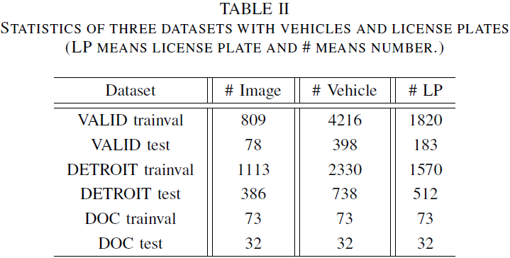

***Udacity Dataset 1*** Udacity self-driving dataset 1 includes driving in Mountain View California and neighboring cities during daylight conditions. It contains over 65000 labels across 9420 frames collected from a camera, which has a resolution of 1200 x 1920 (height x width). The dataset was annotated by a combination of machine learning algorithms and humans. In this paper, all labels of "Car" and "Truck" in Udacity Dataset 1 are transformed to "Vehicle", and all images are randomly divided into the training-validation set and test set by 7:3.

***AOLP-LE*** AOLP[8] provides three categories of license plates for different applications, which are access control (AC), law enforcement (LE), and road patrol (RP). We only experiment on the AOLP-LE, because it is an on-road scenario. 582 images of AOLP-LE are collected at daytime with the resolution of 480 x 640 (height x width), and 175 images are collected at nighttime with the resolution of 240 x 320 (height x width). Almost all images have only one license plate and only a few images have two license plates. All images are randomly divided into training-validation and test set by 7:3.

To sum up, the statistics of the two datasets are illustrated in Table III. There are about 7.05 vehicles per image in Udacity Dataset 1.

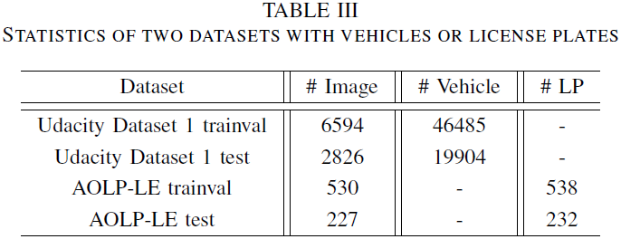

### B. Observed Problem

Furthermore, Figure 6 demonstrates the detection results on the validation set of VALID with SSD300 when training with only one head layer. The dashed line means training vehicle and license plate separately, and the solid line means training vehicle and license plate together. From the graph, we can see that the AP of the license plate drops a lot when training vehicle and license plate together, reaching 40.98% at most, and the detection performance of the vehicle is almost unaffected.

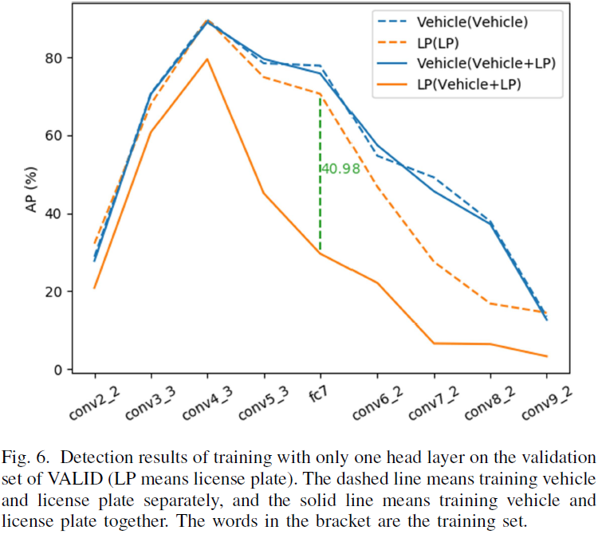

Moreover, various combinations of the head layers based on SSD300 further verify the detection problem. For simplicity, we denote the head layer conv4_3 as H0, conv3_3 as H-1, conv2_2 as H-2, and conv5_3 to conv9_2 as H1 ~ H6. Figure 7 illustrates the detection results on the validation set of VALID with multiple combinations of the head layers. When training together, the AP of the vehicle is not affected, however, the performance of the license plate drops a lot.

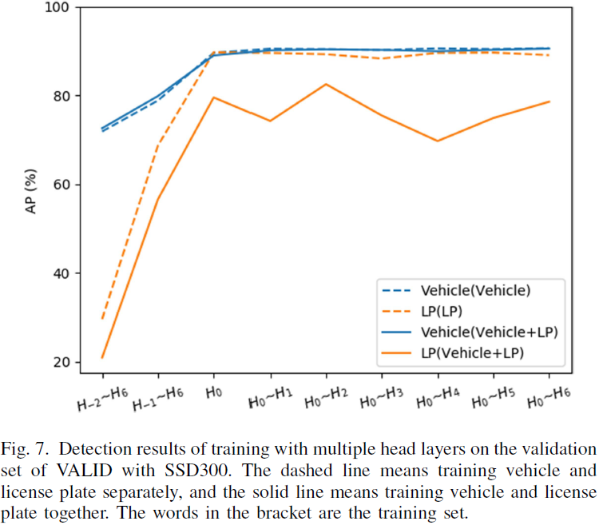

In addition, as shown in Figure 8, we manually remove the background by filling it with the mean of ImageNet[10]. The license plates in the vehicles are either unchanged or randomly distributed to other places as before. In this way, the effects of the background are removed and the effects of the vehicle to the license plate can be tested without interference.

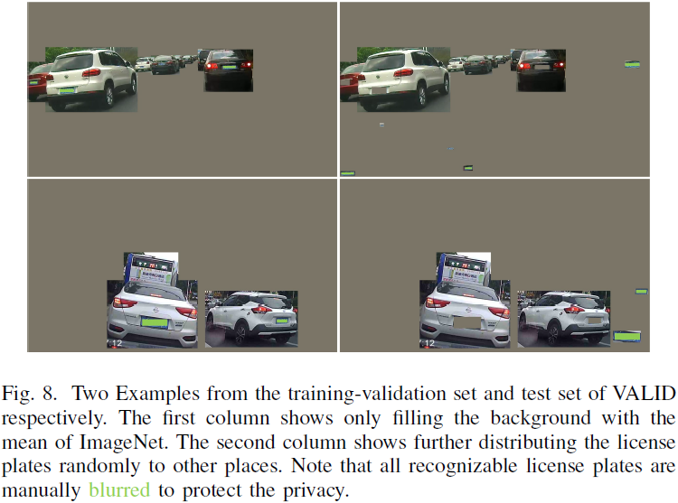

From Table IV, we can see the performance of the vehicle improves a lot for SSD after removing the background. The performance of the license plate is also enhanced after separating from the vehicle because it gets rid of the effects of both the vehicle and the background. However, with SSD, the license plates in the vehicles are still affected by the vehicles.

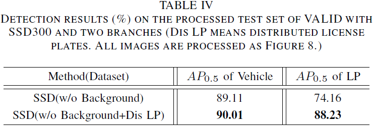

### C. Experiments with Detection Branch

As seen in Figure 6, when training vehicle and license plate in two independent networks, both the vehicle and the license plate achieve the best single-layer performance with conv4_3. Perhaps it is because shallower features have high resolution but weak semantics, and deeper features have strong semantics but low resolution. In addition, it has a close performance for the vehicle and the license plate with conv5_3 and fc7. However, the performance of the license plate drops rapidly using head layers deeper than fc7, because deep layers have large down-sampling rates which are not favorable to small-scale objects. Moreover, as seen in Figure 7, different combinations of head layers deeper than conv4_3 have a steady performance for both the vehicle and the license plate. However, after adding conv3_3 or conv2_2, the performance drops a lot for both the vehicle and the license plate because these head layers bring in too many false positives due to the low semantics and the overwhelming number of anchor boxes. For comparison with SSD, we choose H0 with H0 as the head layers of the license plate detection branch, and select H0 with H2 ~ H6 as the head layers of the vehicle detection branch

### D. Experiments with Anchor Design Strategy

With our anchor design strategy, the anchor priors are more close to the ground truths to generate better detection, as demonstrated in Figure 9. It demonstrates two cropped image blocks from the test set of VALID, where a small vehicle and license plate are failed to be detected by SSD because of inappropriate anchor boxes. These two false negatives are correctly detected with our strategy. Furthermore, due to better matching with the ground truths, our strategy makes the network converge faster, as illustrated in Figure 10.

## REFERENCES
[1]F. Yu and V. Koltun, “Multi-scale context aggregation by dilated convolutions,” in Proceedings of the 4th International Conference on Learning Representations (ICLR), Y. Bengio and Y. LeCun, Eds., San Juan, Puerto Rico, May 2016.

[2]W. Liu, D. Anguelov, D. Erhan, C. Szegedy, S. E. Reed, C.-Y. Fu, and A. C. Berg, “SSD: Single shot MultiBox detector,” in Proceedings of the 14th European Conference on Computer Vision (ECCV), Part I, ser. Lecture Notes in Computer Science, B. Leibe, J. Matas, N. Sebe, and M. Welling, Eds., vol. 9905. Amsterdam, The Netherlands: Springer, Oct. 2016, pp. 21–37.

[3]S. Bell, C. L. Zitnick, K. Bala, and R. Girshick, “Inside-Outside Net: Detecting Objects in Context with Skip Pooling and Recurrent Neural Networks,” in IEEE Conference on Computer Vision and Pattern Recognition (CVPR). Las Vegas, NV, USA: IEEE, Jun. 2016, pp. 2874–2883.

[4]Z. Li and F. Zhou, “FSSD: Feature Fusion Single Shot Multibox Detector,” arXiv preprint arXiv:1712.00960, 2017.

[5]A. Kuznetsova, H. Rom, N. Alldrin, J. Uijlings, I. Krasin, J. Pont-Tuset, S. Kamali, S. Popov, M. Malloci, T. Duerig, and V. Ferrari, “The Open Images Dataset V4: Unified image classification, object detection, and visual relationship detection at scale,” arXiv preprint arXiv:1811.00982, 2018.

[6]J. Krause, M. Stark, J. Deng, and L. Fei-Fei, “3d object representations for fine-grained categorization,” in IEEE International Conference on Computer Vision (ICCV) Workshops. Sydney, Australia: IEEE, Dec. 2013, pp. 554–561.

[7]S. M. Silva and C. R. Jung, “License plate detection and recognition in unconstrained scenarios,” in Proceedings of the 15th European Conference on Computer Vision (ECCV), Part XII, ser. Lecture Notes in Computer Science, V. Ferrari, M. Hebert, C. Sminchisescu, and Y. Weiss, Eds., vol. 11216. Munich, Germany: Springer, Sep. 2018, pp. 593–609.

[8]G.-S. Hsu, J.-C. Chen, and Y.-Z. Chung, “Application-oriented license plate recognition,” IEEE Transactions on Vehicular Technology, vol. 62, no. 2, pp. 552–561, Feb. 2013.

[9]T.-Y. Lin, P. Doll´ar, R. Girshick, K. He, B. Hariharan, and S. Belongie, “Feature pyramid networks for object detection,” in IEEE Conference on Computer Vision and Pattern Recognition (CVPR). Honolulu, HI, USA: IEEE, Jul. 2017, pp. 936–944.

[10]O. Russakovsky, J. Deng, H. Su, J. Krause, S. Satheesh, S. Ma, Z. Huang, A. Karpathy, A. Khosla, M. Bernstein, A. C. Berg, and L. Fei-Fei, “ImageNet Large Scale Visual Recognition Challenge,” International Journal of Computer Vision, vol. 115, no. 3, pp. 211–252, Dec. 2015.
