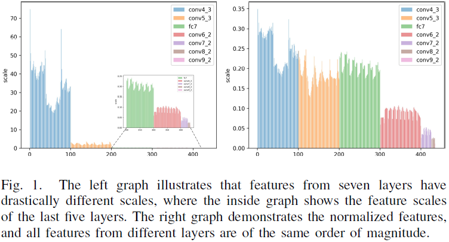

# Simultaneous End-to-End Vehicle and License Plate Detection with Multi-Branch Attention Neural Network ***Supplementary Materials***

## III. METHODOLOGY
### A. Base Network
The details of the backbone network are shown in Table I without the ReLU activation function, where layers with **bold** font denote the transformed VGG-16 and the remainders represent the extra layers. As for parameters, "k" means kernel size, "s" stride size, and "d" dilation[1] parameters. In addition, "ceil" means rounding up the size if not divisible, so the size of conv3_3 maybe not exactly 2 times of conv4_1. In addition, layers marked with "\*" are candidates for detection head layers.

### B. Detection Branch
The scale of features in different layers may be quite different, making it difficult to combine them for detection directly, as illustrated in Figure I. The left graph illustrates that features from seven layers have drastically different scales, where the inside graph shows the feature scales of the last five layers. The right graph demonstrates the normalized features, and all features from different layers are of the same order of magnitude.

## REFERENCES
[1]F. Yu and V. Koltun, “Multi-scale context aggregation by dilated convolutions,” in Proceedings of the 4th International Conference on Learning Representations (ICLR), Y. Bengio and Y. LeCun, Eds., San Juan, Puerto Rico, May 2016.
